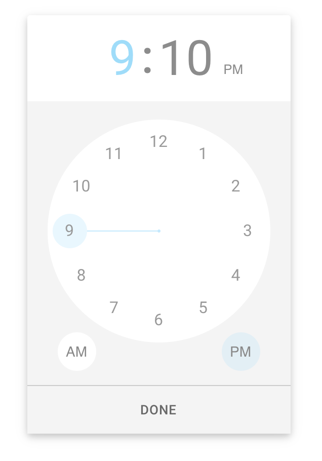

### Repo for forked modules that require custom editing. License should generally be MIT or equivalent if you want to edit open source code. 

### Add module to your project
Add to your project's package.json like so:  

    "react-timekeeper": "https://github.com/SnapClose/forked-modules.git#react-timekeeper",

### Add module to this repo:

    git clone https://github.com/SnapClose/forked-modules.git ; cd forked-modules ; for remote in $(git branch -r | grep -vE "HEAD|master"); do git branch --track ${remote#*/} $remote; done ; git checkout master

    git checkout -b your_branch_name

Duplicate the module you want to copy in here, and commit to your branch name.

------------

<!-- 
TODO
- update react spring to v9 on release
	- should fix about of typescript issues
- fix remaining typescript errors
- add units tests for components once enzyme gains better supports shallow
-->

<h1 align="center">
	
	<br/>
	React Timekeeper
</h1>

<p align="center">
  <a href="https://npmjs.org/package/driver.js">
    
  </a>
  <a href="https://www.npmjs.com/package/react-timekeeper">
    
  </a>
  <a href="https://github.com/catc/react-timekeeper/blob/master/LICENSE">
    
  </a>
</p>

<p align="center">
	<b>
		Time picker based on the style of the
		<a href="https://play.google.com/store/apps/details?id=com.google.android.keep" target="_blank">
		Android Google Keep
		</a>
		app.
	</b>
</p>

------------

**Features**
- supports both 12 hour and 24 hour mode, and flexible time formats
- simple to use with many customizable options
- smooth, beautiful animations with [react spring](https://www.react-spring.io)
- typescript support

## Installation

```shell
$ npm install --save react-timekeeper
```

Version 2+ of timekeeper requires [react hooks (v16.8)](https://reactjs.org/blog/2019/02/06/react-v16.8.0.html). If you're using an older version of react, install timekeeper v1 via 
```shell
$ npm install --save react-timekeeper@^1.0.0
```

## Usage

```javascript
import React from 'react';
import TimeKeeper from 'react-timekeeper';

function YourComponent(){
  const [time, setTime] = useState('12:34pm')
  
  return (
    <div>
      <Timekeeper
        time={time}
        onChange={(data) => setTime(data.formatted12)}
      />
      <span>Time is {time}</span>
    </div>
  )
}
```

All styles are inlined via [emotion](https://github.com/emotion-js/emotion) so no css imports are required.

## API
For full api and examples, see [API docs](https://catc.github.io/react-timekeeper/#api) and [examples](https://catc.github.io/react-timekeeper/#examples)


## Development
1. Clone the repo
3. `nvm use v10.16.0` (or anything >10)
2. `npm install`
3. `npm run docs:dev`
4. Navigate to `localhost:3002`

------------

Other useful commands:
- build docs: `npm run docs:build`
- run all tests: `npm run tests`
- watch tests: `npm run tests:watch`
- create lib to publish npm: `npm run lib`

>>>>>>> 6ec4692ffcb15259555758173d8b4d9938703995
